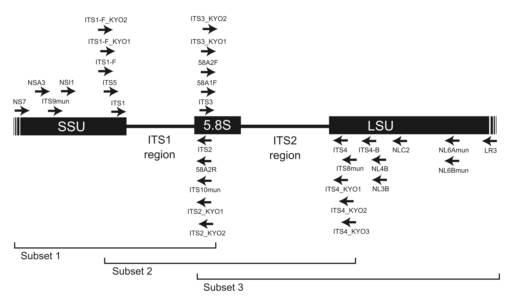
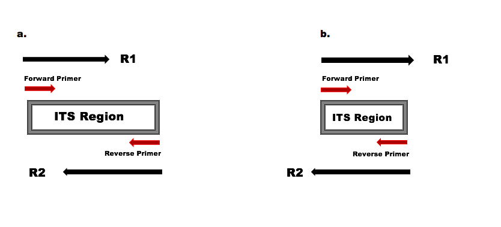
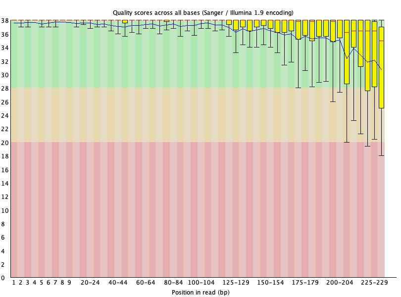
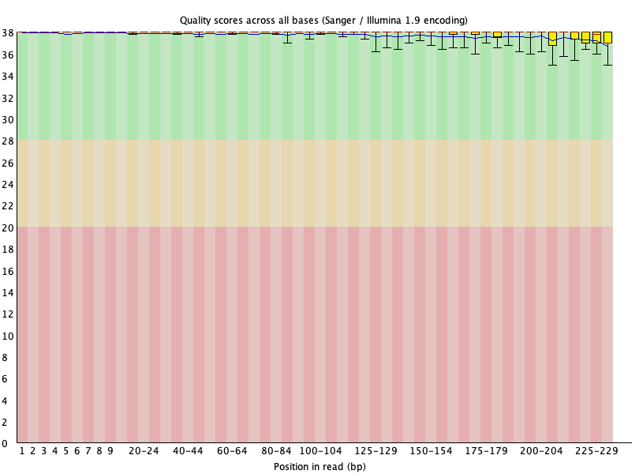
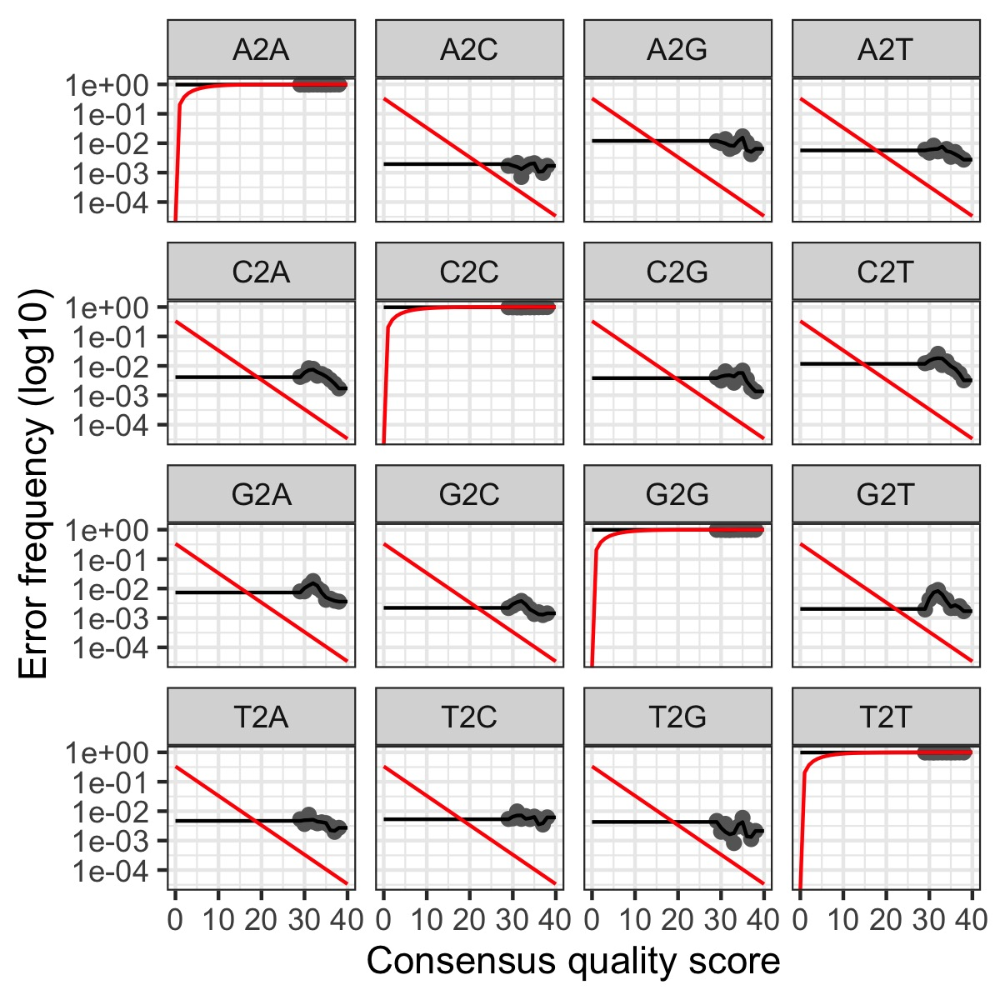

# **Poplar Microbiome Project**

## **Bioinformatics project for the Big Data in Agriculture Internship**

Student: Morgan Miller

Mentor: Ricardo Alcala Briseno

Principle Investigator: Jared LeBoldus

## **Objective**

Use ITS metabarcoding to characterize the fungal wood microbiome of diseased (infected with *Sphaerulina musiva*) and healthy *Populus trichocarpa* trees. Comparison of microbiome makeup and diversity between diseased and healthy trees could illuminate how fungal endophytes contribute to phytopathogen resistance.

See `(Busby LeBoldus) NSF RAPID Proposal.pdf` in the `literature` directory for more information.

## **Background**

In 2018, an outbreak of the phytopathogen *Sphaerulina musiva* was reported in a *Populus trichocarpa* (Black Cottonwood) plantation in northeastern Oregon. Introduction of *S. musiva* to the Pacific Northwest threatens both regional hybrid-poplar plantations and native riparian ecosystems where cottonwoods are instrumental in floodplain succession and ecological functioning.

Recent studies have demonstrated that fungal endophytes (fungal microbes living within plant tissues) can modify the disease resistance and susceptibility of their plant hosts. Despite a growing interest in fungal endophyte research, the specifics of these interactions remain poorly understood. Fungal endophytes are seemingly capable of modifying plant-disease in a variety of ways including:

-   Directly antagonizing phytopathogens

-   Indirectly competing with phytopathogens

-   Activating host-resistance

-   Suppressing host-resistance.

The diversity and complexity of fungal endophyte communities makes characterizing these interactions challenging. Quantitative molecular approaches such as ITS metabarcoding will be critical for developing our understanding of fungal endophyte communities and their effect on disease resistance and susceptibility.

## **Acknowledging Biases Associated with ITS Amplification for Determining Species Composition.**

In a perfect world, every ITS region of the DNA fragments present in the original samples would be replicated evenly and proportionately before sequencing, giving us a dataset that represents the biological reality of the samples. Unfortunately, biases and errors introduced during the PCR process can skew sequencing results by overrepresenting or underrepresenting certain taxa or by producing erroneous DNA fragments. There are many factors that contribute to PCR bias and error within the ITS metabarcoding process:

-   Taxonomic Bias: Certain combinations of ITS primers may favor certain taxonomic groups over others leading to disproportionate amplification and representation.

-   Length Bias: ITS region length will vary between taxonomic groups. Because shorter sequences are more easily amplified than longer sequences when PCR is performed on sequences with varied length simultaneously, inherent diversity in ITS region length could contribute to disproportionate representation of certain taxonomic groups.

-   Mismatch Bias: Certain combinations of ITS primers respond differently to PCR conditions that would allow or disallow 'mismatches' where the primer sequence differed from the binding region by a few base pairs. This means that under strict PCR conditions, primer 'preference' might be more severe.

Clearly, the primers used for amplification considerably contribute to the potential for PCR bias and error. Careful consideration of primer strengths and challenges is critical for minimizing amplification error prior to sequencing. For this study, ITS3_KY01 (forward) and ITS4 (reverse) were used to amplify the ITS2 region of the structural Neucular Ribsomal DNA (nrDNA).

[](https://www.ncbi.nlm.nih.gov/pmc/articles/PMC3395698/)

## **ASVs and OTUs**

Sequencing technology introduces error. In order for any analysis to meaningfully represent the biological reality of a microbiome, sequencing error must be addressed. Otherwise, every sequence with an incorrect base call would be treated as if it represented a distinct organism in the community. A standardized technique for de-noising sequence data is the construction of Operational Taxonomic Units (OTUs). OTUs are created by grouping sequences together based on similarity. In essence OTUs resolve sequencing error by 'blurring' similar sequences together so that minimal error won't lead to erroneously identified taxa. More recently, algorithms have been developed that can produce Amplicon Sequence Variants (ASVs) by inferring exact sequences and separating them from those likely caused by error with high confidence.

For this study, ASVs are particularly advantageous. Because fungal wood microbiomes are relatively under-studied, ASVs allow for identification of fungal endophytes that might not be documented in a reference database. Open Reference Clustering techniques, and the OTUs they would produce, would likely fail to identify undocumented members of the microbial community due to reference bias\*. Additionally, ASVs allows these results to be meaningfully compared with other ongoing and future research efforts.

\*Of course ASVs do not eliminate reference bias altogether as they still need to be compared to a database for taxonomic assignment.

### **Video Resource**

This page contains an excellent video comparing ASVs and OTUs. Produced by Michael Weinstein at Zymo Research: <https://www.zymoresearch.com/blogs/blog/microbiome-informatics-otu-vs-asv>.

## **Data Cleaning and De-noising Procedure**

Almost all of this procedure is closely adapted from the DADA2 ITS Pipeline Workflow documentation: <https://benjjneb.github.io/dada2/ITS_workflow.html>.

### **Raw Data**

528 wood samples were collected from the infected *Populus trichocarpa* plantation. Samples were processed and ITS PCR performed to amplify the region of interest. Samples were multiplexed and combined before being sequenced (Paired-end 'sequencing by synthesis' - Illumina). Reads were demultiplexed before cleaning and analysis.

### Pre-Filter Ns

When sequencing technology is unable to identify a base in a sequence, it will place an 'N' in that position. Ambiguous bases make identifying primer sequences much more challenging computationally, and are generally not helpful when constructing and analyzing ASVs. We can remove sequences containing Ns by using DADA2's `filterAndTrim()` command.

``` r
nout <- filterAndTrim(fnFs, fnFs_filtN, fnRs, fnRs_filtN, maxN = 0, multithread = TRUE)
```

In this command we designate the input and output files for the forward and reverse reads with the first four arguments. With `maxN = 0` we are telling the filter to remove any sequence that contains even a single N.

### **Remove Primers (Cutadapt)**

Cutadapt Documentation: <https://cutadapt.readthedocs.io/en/stable/guide.html>.

Because of the variability in ITS sequence lengths within our samples, read-through errors can sometimes mean reverse-compliment primer sequences show up in our reads. Even some forward-oriented primer sequences can show up in our reads. Cutadapt allows us to find and remove every instance of every orientation of primer sequence from our reads.

[](https://benjjneb.github.io/dada2/ITS_workflow.html)

Before primer removal some reads had many reverse compliment primer sequences indicating read-through error.

|                   | Forward | Complement | Reverse | Reverse Compliment |
|-------------------|---------|------------|---------|--------------------|
| FWD.Forward.Reads | 0       | 0          | 0       | 0                  |
| FWD.Reverse.Reads | 0       | 0          | 0       | 2285               |
| REV.Forward.Reads | 0       | 0          | 0       | 2521               |
| REV.Reverse.Reads | 2       | 0          | 0       | 0                  |

``` r
for(i in seq_along(fnFs)) {
system2(cutadapt, args = c(R1.flags, R2.flags, "-n", 2,
                          "-o", fnFs_cut[i], "-p", fnRs_cut[i],
                          fnFs_filtN[i], fnRs_filtN[i]))
}
```

|                   | Forward | Complement | Reverse | Reverse Compliment |
|-------------------|---------|------------|---------|--------------------|
| FWD.Forward.Reads | 0       | 0          | 0       | 0                  |
| FWD.Reverse.Reads | 0       | 0          | 0       | 0                  |
| REV.Forward.Reads | 0       | 0          | 0       | 0                  |
| REV.Reverse.Reads | 0       | 0          | 0       | 0                  |

After running cut adapt from an R script (using `system2` command), all orientations of primer sequences are removed from the reads. `R1.flags` and `R2.flags` are variable that contain all of the primers sequence orientations to be removed. The `"-n"` argument tells cut adapt to remove up to two primer sequence orientations from each read. The final four arguments simply designate input and output files.

### Filter and Trim Reads (DADA2)

To ensure that the fungal endophyte communities in our samples are accurately characterized, we must filter and trim our sequences to only include high quality base-calls and remove erroneous sequences that are too short to be a correctly amplified ITS2 sequence. For this we use DADA2's `filterAndTrim()` command again.

``` R
fout <- filterAndTrim(fnFs_cut, filtFs, fnRs_cut, filtRs, maxN=0, 
                    maxEE=c(2,2), truncQ=28, compress=TRUE, multithread=TRUE,
                    minLen=90)
```

Importantly, `truncQ=28` tells the filter to 'trim' sequences once they dip below a certain quality score. Illumina sequencers assign each base call with a quality score that represents how confident the sequencer was that it made the correct base call.

Illumina quality score documentation: <https://www.illumina.com/documents/products/technotes/technote_Q-Scores.pdf>

A Phreq quality score (Q score) of 28 is equivalent to .99.84151% confidence in a correct base-call accuracy. This threshold can be adjusted based on the circumstances of the study and the available.

Additionally, we are using `minLen=90` to remove sequences that are too short to be ITS2 regions, probably contamination or erroneous fragments.





### Alignment with Reference Genome to Remove Host Sequences (Bowtie2)

Unfortunately, unnecessary host DNA present in our samples can be amplified and sequenced alongside the fungal endophyte DNA we are interested in. To remove host sequences, we can use Bowtie2 to see what filtered reads can be aligned with the unmasked *Populus Trichocarpa* reference genome. Reads that align with the host genome can be easily discarded.

Reference genome downloaded from: <https://phytozome-next.jgi.doe.gov/info/Ptrichocarpa_v4_1>

For this project, two shell scripts: `align.sh` and `control.sh` in the `genome` directory were used to process our filtered reads. `align.sh` used `Bowtie2` in conjunction with `bedtools` and `samtools` to align the reads and `control.sh` simply iterated `align.sh` for every sample that made it through the filter.

### Learn Error Rates

DADA2 uses an algorithm to create a unique error model for the input dataset. This error model is important for the de-noising process so that the program can confidently distinguish sequences resulting from error from those that represent the biological reality of our sample.

``` R
errF <- learnErrors(post_filter_fnFs, multithread=TRUE)
errR <- learnErrors(post_filter_fnRs, multithread=TRUE)
```


